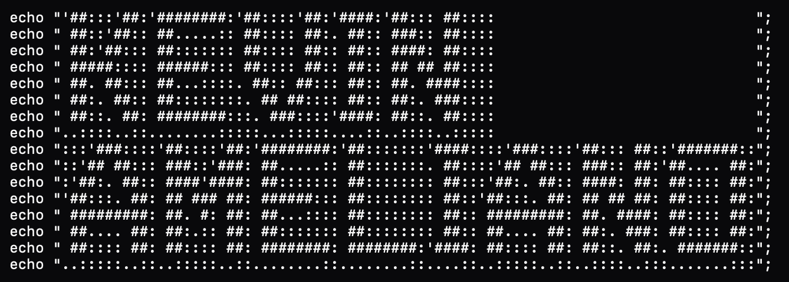

    

  <!-- Ganti link src di bawah ini dengan link GIF anime/game favorit Anda -->
  

 

  

---

### 🕹️ Character Lore
a *Tech-Mage* who can combine software engineering logic, artificial intelligence algorithms, and digital marketing tactics. Focuses on *bug* fixing, developing intelligent systems, and designing optimal digital strategies.

---

### ⚔️ Skill Tree

**< Website Developer />**

  
  
  
  
  
  
  
  
  
  
  
  
  

**< AI/ML Engineer />**

  
  
  
  
  
  

**< Digital Marketing & Tools />**

  
  
  

---

### 🏆 Player Stats

  <!-- Menggunakan tema 'tokyonight' agar bernuansa gelap neon ala cyberpunk/game -->
  
  

   
  
  
<i>"Leveling up one commit at a time."</i>

---

### 🏆 My Stats

    
    
    
  

---

### 🏆 Play Games With Me
<picture data-importer="pacman">
  <source media="(prefers-color-scheme: dark)" srcset="https://raw.githubusercontent.com/kevindavid911/kevindavid911/pacman-output/pacman-contribution-graph-dark.svg?game=pacman">
  <source media="(prefers-color-scheme: light)" srcset="https://raw.githubusercontent.com/kevindavid911/kevindavid911/pacman-output/pacman-contribution-graph.svg?game=pacman">
  
</picture>